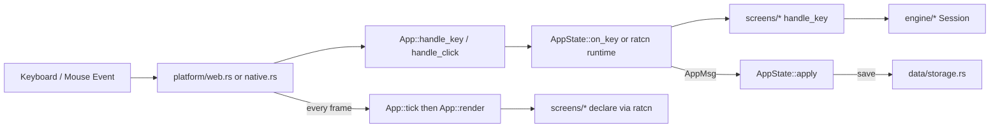
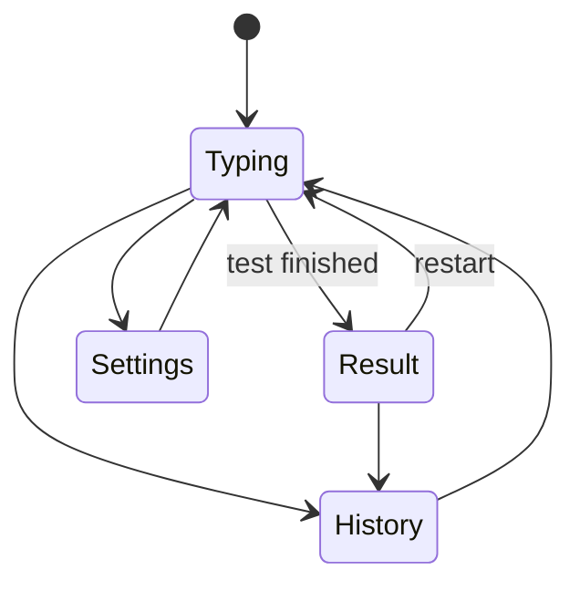

# Ratype — Architecture Design

**Ratype** is a local-first, serverless code typing test written in Rust. One codebase targets the **web (WebAssembly via Ratzilla)** and the **native terminal (via Crossterm)**.

## Architectural Principles

1. **Local-first**: no backend, API, or database. Config, snippets, and history stay on the user's machine.
2. **Dual-target**: browser (WebGL2 canvas) and native terminal.
3. **Separation of concerns**: `engine/` holds the typing math and never imports UI types. `data/` never touches `ratcn` themes.
4. **Offline**: snippets and audio are embedded at compile time.
5. **No `mod.rs`**: every module is `foo.rs` plus a `foo/` directory for its parts.

## Tech Stack

| Domain                 | Crate                                                                                                                                                                                                         | Role                                                    |
| :--------------------- | :------------------------------------------------------------------------------------------------------------------------------------------------------------------------------------------------------------ | :------------------------------------------------------ |
| **TUI**                | [`ratatui`](https://crates.io/crates/ratatui) 0.30, [`ratcn`](https://crates.io/crates/ratcn) 0.0.3                                                                                                           | Rendering. ratcn adds the declarative runtime, themes, and `src/ratcn/` components. |
| **Web**                | [`ratzilla`](https://crates.io/crates/ratzilla), [`web-sys`](https://crates.io/crates/web-sys), [`js-sys`](https://crates.io/crates/js-sys), [`console_error_panic_hook`](https://crates.io/crates/console_error_panic_hook), [`trunk`](https://trunkrs.dev/) | WebGL2 backend, `localStorage`, `AudioContext`, panic traces, bundler. |
| **Native**             | [`crossterm`](https://crates.io/crates/crossterm), [`color-eyre`](https://crates.io/crates/color-eyre), [`rodio`](https://crates.io/crates/rodio), [`dirs`](https://crates.io/crates/dirs)                       | Terminal events, error reports, audio, config directory. |
| **Widgets and search** | [`tui-big-text`](https://crates.io/crates/tui-big-text), [`fuzzy-matcher`](https://crates.io/crates/fuzzy-matcher)                                                                                            | Big CPM number, language search.                        |
| **Core**               | [`serde`](https://crates.io/crates/serde), [`serde_json`](https://crates.io/crates/serde_json), [`strum`](https://crates.io/crates/strum), [`fastrand`](https://crates.io/crates/fastrand), [`web-time`](https://crates.io/crates/web-time), [`time`](https://crates.io/crates/time) | JSON, enum helpers, random picks, timer, timestamps. |

## Directory & File Structure

```text
ratype/
├── Cargo.toml               # Target-specific dependencies
├── index.html               # Trunk host page
├── ratcn.toml               # cargo ratcn config (components = "src/ratcn")
├── .github/workflows/ci.yml # fmt, clippy, doc, tests on macOS and Windows
├── assets/
│   ├── snippets/            # One JSON per language (27)
│   └── audio/               # oreo.ogg and config.json (slice timings)
│
└── src/
    ├── main.rs              # platform::run(App::default())
    ├── app.rs               # App, AppState, AppMsg, key routing, test lifecycle
    ├── audio.rs             # Key click (web-sys vs rodio)
    │
    ├── platform.rs          # Picks the runner at compile time
    ├── platform/
    │   ├── web.rs           # Ratzilla runner
    │   └── native.rs        # Crossterm runner
    │
    ├── engine.rs
    ├── engine/              # [CORE] Pure typing logic
    │   ├── session.rs       # Typed chars, backspace, completion
    │   └── stats.rs         # CPM, accuracy, consistency
    │
    ├── data.rs
    ├── data/                # [DATA] Config, snippets, persistence
    │   ├── config.rs        # UserConfig and its option enums
    │   ├── languages.rs     # Language enum, search, embedded snippets
    │   ├── snippet.rs       # Snippet, SnippetData, length filter
    │   └── storage.rs       # Load/save config and history, AppError
    │
    ├── screens.rs           # CurrentScreen, Ctx alias
    ├── screens/             # [PRESENTATION] one dir per screen
    │   ├── layout.rs        # Layout helpers shared between screens
    │   ├── typing.rs        # + typing/{code_view, controls, telemetry, footer, input}.rs
    │   ├── result.rs        # + result/{hero, chart, stat_cards, footer, input}.rs
    │   ├── settings.rs      # + settings/{view, language_picker, option_tabs, footer, input}.rs
    │   └── history.rs       # + history/{view, filter_bar, records_table, footer, input}.rs
    │
    ├── ratcn.rs
    ├── ratcn/               # [COMPONENTS] barchart, button, progress, scroll_area, select, tabs, toast
    │
    ├── utils.rs
    └── utils/
        ├── cycle.rs         # Step through a list
        ├── theme.rs         # ThemeChoice to ratcn::Theme
        ├── time.rs          # Timestamp formatting
        └── timer.rs         # Pausable stopwatch
```

## Layer Responsibilities

| Directory           | Responsibilities                                                                                                                        |
| :------------------ | :-------------------------------------------------------------------------------------------------------------------------------------- |
| **`src/app.rs`**    | One `App` holding `RefCell<AppState>` and the ratcn runtime. Owns screen, config, history, session, timer, and toasts. UI changes go through `AppMsg`. |
| **`src/platform/`** | Thin runners that call `App::tick`, `render`, `handle_key(code, ctrl)`, and `handle_click`. No app logic.                                |
| **`src/engine/`**   | Typing mechanics and metrics. UI-independent and unit-tested.                                                                           |
| **`src/data/`**     | Config types, snippet loading and filtering, persistence. Returns `Result<T, AppError>`.                                                |
| **`src/screens/`**  | Declares each screen with ratcn and handles that screen's keys. `foo.rs` only lays out the area, the parts live in `foo/`.              |
| **`src/ratcn/`**    | Components managed by `cargo ratcn`, not hand-edited. App-specific views live next to their screen.                                      |
| **`src/utils/`**    | Small shared helpers.                                                                                                                   |
| **`src/audio.rs`**  | Key click playback.                                                                                                                     |

`cfg(target_arch = "wasm32")` code lives only in `platform/`, `audio.rs`, `data/storage.rs`, and the `KeyCode` re-export in `app.rs`.

## Storage

- **Web**: `localStorage`, keys `ratype-config` and `ratype-history`.
- **Desktop**: `config.json` and `history.json` in `ratype/` under the OS config directory.
- Missing or unreadable data falls back to defaults.

## Typing Metrics

- **Net CPM**: only characters that are correct right now, so erasing and retyping never inflates it.
- **Raw CPM** and **accuracy**: every keystroke.
- **Consistency**: 100 minus the coefficient of variation (%) of the speed samples, taken at most once a second.

Other typing rules (snippet normalization, indent skipping, backspace limits) live in `engine/session.rs` next to their tests.

## Runtime Data Flow



## Screen State Transitions



The result screen can also open settings. A finished test is saved to history before the result screen shows, if the timer measured any time. Leaving a finished test for typing starts a fresh snippet.

## Terminal Size

- **Minimum 70 columns x 18 rows.** Below that, `App::render` shows "Ratype needs at least 70 columns × 18 rows." instead of the screen.
- Content is centered and at most 108 columns wide.
- **Resize**: Ratatui (native) and Ratzilla (web) pick up the new size on the next frame. No app code needed.
