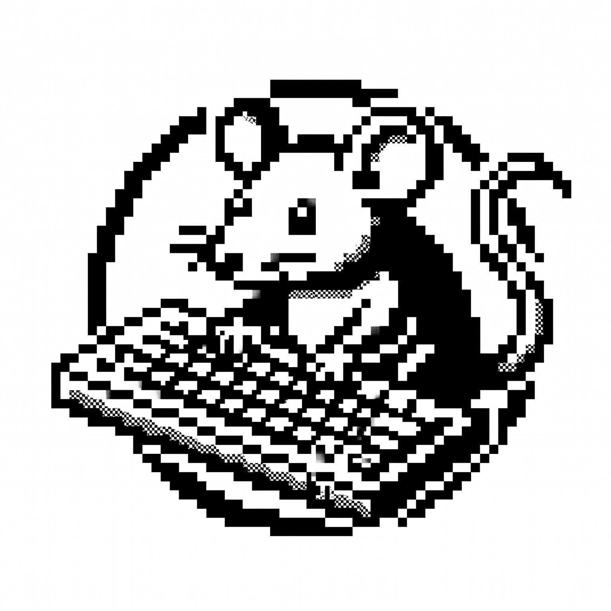

# Ratype



**A code typing test for the terminal and the browser.**

Type real code snippets, see your speed and accuracy, and track your progress.
Everything runs locally, with no account and no server.

Built with Rust, [Ratatui](https://ratatui.rs), and [Ratzilla](https://github.com/ratatui/ratzilla).

[**Try it in your browser**](https://ratype.dirga.dev) · [Architecture](ARCHITECTURE.md) · [License](LICENSE)


## Features

| | |
| :-- | :-- |
| **Real code** | 27 programming languages|
| **Your pace** | Short, medium, and long snippets, in full-snippet or 15, 30, and 60 second mode |
| **Live feedback** | Time, speed (CPM), accuracy, and progress while you type |
| **Results** | CPM over time chart, raw CPM, consistency, and errors |
| **History** | Every test saved locally, filtered by language |
| **Your setup** | Six themes, three caret styles, and an optional key click sound |
| **Input** | Keyboard and mouse |

## Getting started

### Browser

Open <https://ratype.dirga.dev>.

### Terminal

```sh
cargo install ratype
ratype
```

The terminal needs at least 70 columns by 18 rows.

### From source

```sh
cargo run --release
```

For the web build you need [Trunk](https://trunkrs.dev/) and the `wasm32-unknown-unknown` target:

```sh
trunk serve
```

Then open <http://localhost:8080>.

## Keys

| Key                | Action                                                 |
| :----------------- | :----------------------------------------------------- |
| `Tab`              | New snippet (repeat the same one on the result screen) |
| `Esc`              | Open settings, and go back to typing                   |
| `F2`               | Change theme                                           |
| `F3`               | Open history                                           |
| `Ctrl+Q`, `Ctrl+C` | Quit                                                   |

Every screen shows its own key hints and buttons.

## Development

See [ARCHITECTURE.md](ARCHITECTURE.md) for the structure. Before sending a change, run:

```sh
cargo clippy -- -D warnings
cargo clippy --target wasm32-unknown-unknown -- -D warnings
cargo test
```

## License

Licensed under the [MIT LICENSE](./LICENSE).
